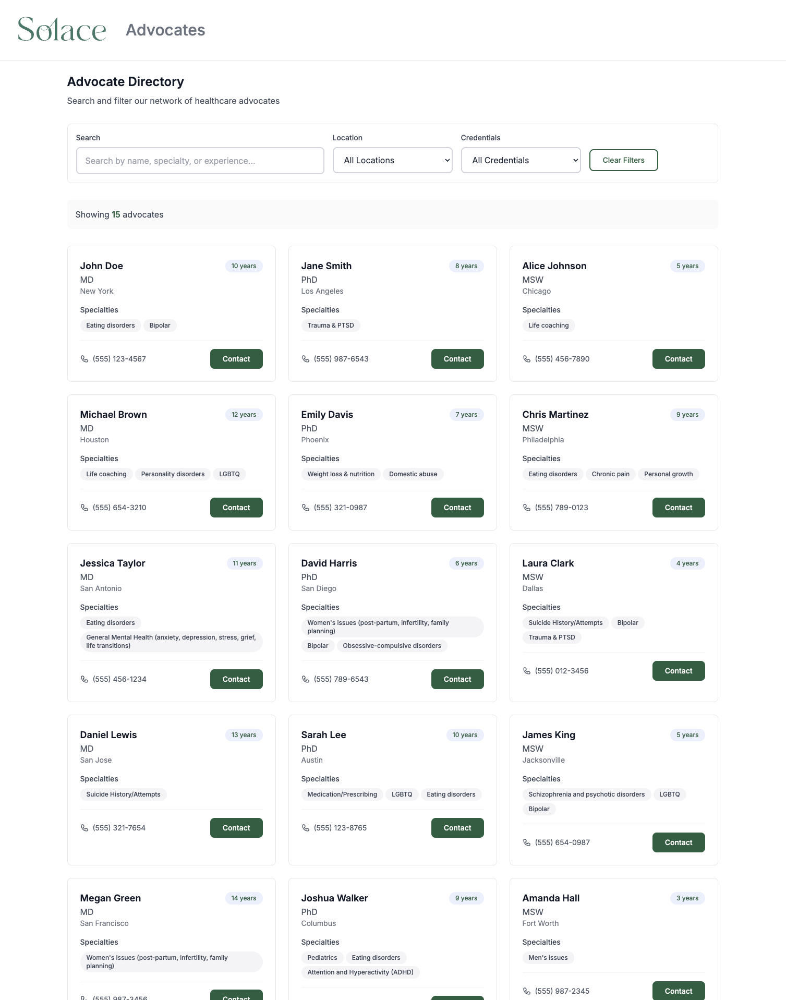
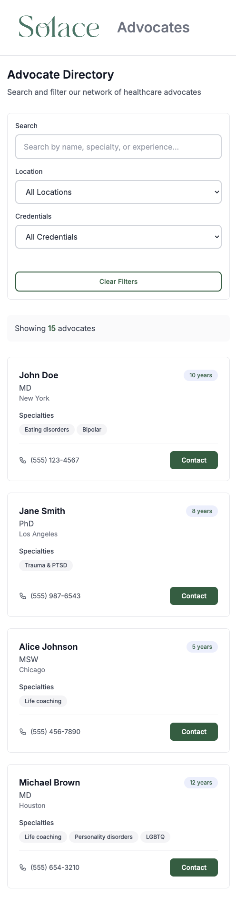

# Solace Advocate Directory

A modern, responsive healthcare advocate directory built with Next.js, featuring Solace Health branding and a professional dashboard interface.

## 📱 Screenshots

### Desktop View


### Mobile View  


## 🚀 Features

- **🔍 Advanced Search & Filtering**: Search by name, specialty, experience, location, and credentials
- **📱 Fully Responsive Design**: Optimized for desktop, tablet, and mobile devices
- **🎨 Solace Health Branding**: Authentic logo and color scheme matching Solace brand
- **📞 Direct Contact**: Click-to-call functionality for mobile devices
- **⚡ Real-time Filtering**: Instant results as you type
- **🎯 Professional Interface**: Clean dashboard design for logged-in users
- **📊 Comprehensive Data**: Detailed advocate profiles with specialties and experience

## 🛠️ Tech Stack

- **Frontend**: Next.js 14, React, TypeScript
- **Styling**: Tailwind CSS, CSS Modules, Custom Design System
- **Database**: PostgreSQL with Drizzle ORM
- **Development**: Docker, ESLint, Jest, React Testing Library

## Getting Started

### 1. Install dependencies

```bash
npm i
```

### 2. Set up environment configuration

The application will automatically create a `.env.local` file from the template. For detailed environment setup instructions, see [ENVIRONMENT.md](./ENVIRONMENT.md).

```bash
npm run setup-env
```

### 3. Start the development server

```bash
npm run dev
```

Open [http://localhost:3000](http://localhost:3000) with your browser to see the result.

## Database Setup

The application supports both mock data (for quick development) and a real PostgreSQL database.

### Quick Start (Mock Data)
The app will work out of the box with mock data - no database setup required!

### Full Database Setup

1. **Start PostgreSQL with Docker**
   ```bash
   docker compose up -d
   ```

2. **Set up environment variables**
   ```bash
   npm run setup-env
   # Edit .env.local with your database URL
   ```

3. **Run database migrations**
   ```bash
   npm run migrate:up
   ```

4. **Seed the database**
   ```bash
   curl -X POST http://localhost:3000/api/seed
   ```

## Environment Configuration

For detailed environment setup, configuration options, and troubleshooting, see [ENVIRONMENT.md](./ENVIRONMENT.md).

## 📋 Available Scripts

### Development
- `npm run dev` - Start development server
- `npm run build` - Build for production
- `npm run start` - Start production server
- `npm run lint` - Run ESLint
- `npm run lint:fix` - Fix ESLint issues

### Testing
- `npm run test` - Run tests
- `npm run test:watch` - Run tests in watch mode
- `npm run test:coverage` - Run tests with coverage

### Database
- `npm run setup-env` - Set up environment configuration
- `npm run migrate:up` - Run database migrations
- `npm run seed` - Seed the database

## 🏗️ Project Structure

```
src/
├── app/                    # Next.js app directory
│   ├── api/               # API routes
│   ├── components/        # React components
│   └── page.tsx          # Main page component
├── db/                    # Database configuration
│   ├── schema.ts          # Drizzle schema
│   └── seed/              # Seed data
├── hooks/                 # Custom React hooks
├── lib/                   # Utility libraries
└── styles/                # Global styles and design system
```

## 📚 Documentation

- **[Environment Setup](./docs/ENVIRONMENT.md)** - Detailed environment configuration and troubleshooting
- **[API Documentation](./docs/API.md)** - Complete API reference and endpoints
- **[Deployment Guide](./docs/DEPLOYMENT.md)** - Production deployment instructions and best practices
- **[Contributing Guide](./docs/CONTRIBUTING.md)** - Development guidelines and contribution process
- **[Development Discussion](./docs/DISCUSSION.md)** - Technical decisions and architecture notes
- **[Project Backlog](./docs/BACKLOG.md)** - Issues, improvements, and future enhancements
